# Logistic_Regression_Evaluation
Evaluate the effectiveness of a Logistic Regression Model for classification by generating and comparing the accuracy score, a confusion matrix, and the classification report for the original data and then for `oversampled`  minority class data.

---

## Technologies

This project leverages python 3.7 with the following packages:

**[Numpy Library](https://numpy.org/)** - NumPy offers comprehensive mathematical functions, random number generators, linear algebra routines, Fourier transforms, and more.<br>

**[Pandas Library](https://pandas.pydata.org/)** - pandas is a fast, powerful, flexible and easy to use open source data analysis and manipulation tool,
built on top of the Python programming language.<br>

**[Pathlib Library](https://pathlib.readthedocs.io/en/pep428/)** - This module offers a set of classes featuring all the common operations on paths in an easy, object-oriented way.<br>

**[SkLearn.metrics Balanced Accuracy Score](https://scikit-learn.org/stable/modules/generated/sklearn.metrics.balanced_accuracy_score.html)** - The balanced accuracy in binary and multiclass classification problems to deal with imbalanced datasets. It is defined as the average of recall obtained on each class.<br>

**[SkLearn.metrics Confusion Matrix](https://scikit-learn.org/stable/modules/generated/sklearn.metrics.confusion_matrix.html)** - Compute confusion matrix to evaluate the accuracy of a classification.<br>

**[imblearn.metrics Classification Report Imbalanced](https://imbalanced-learn.org/dev/references/generated/imblearn.metrics.classification_report_imbalanced.html)** - Build a classification report based on metrics used with imbalanced dataset.<br>

**[SkLearn.preprocessing Standard Scaler](https://scikit-learn.org/stable/modules/generated/sklearn.preprocessing.StandardScaler.html)** - Standardize features by removing the mean and scaling to unit variance.<br>

**[SkLearn.model_selection train_test_split](https://scikit-learn.org/stable/modules/generated/sklearn.model_selection.train_test_split.html)** - Split arrays or matrices into random train and test subsets.<br>

**[SkLearn.linear_model Logistic Regression](https://scikit-learn.org/stable/modules/generated/sklearn.linear_model.LogisticRegression.html)** - Logistic Regression (aka logit, MaxEnt) classifier.<br>

**[imblearn.over_sampling Random Over Sampler](https://imbalanced-learn.org/dev/references/generated/imblearn.over_sampling.RandomOverSampler.html)** - Class to perform random over-sampling.

---

## Installation Guide

Before running the application first install the following dependencies:

For this application, you need to add the imbalanced-learn and PyDotPlus libraries to your `dev` virtual environment. The imbalanced-learn library has models that were developed specifically to deal with class imbalance. You’ll use PyDotPlus to plot a decision tree.

### Install imbalance-learn

1. Open a terminal window, and then activate your `dev` virtual environment by running the following command:

```python
conda activate dev
```

2. Install imbalance-learn by running the following command:

```python
conda install -c conda-forge imbalanced-learn
```

3. Verify the installation by running the following command:

```python
conda list imbalanced-learn
```

4. Note that the result on your screen should resemble the following image:

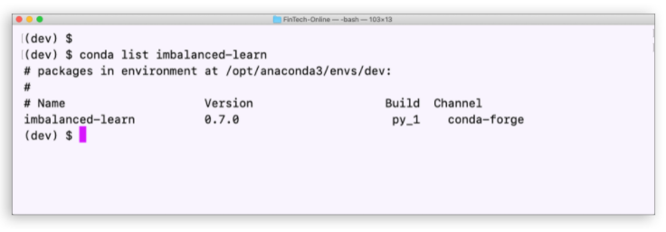


### Install PyDotPlus

1. If your `dev` virtual environment is still active, skip to Step 2. Otherwise, activate your `dev` virtual environment by running the following command:

```python
conda activate dev
```

2. Install PyDotPlus by running the following command:

```python
conda install -c conda-forge pydotplus
```

3. Verify the installation by running the following command:

```python
conda list pydotplus
```

Note that the result on your screen should resemble the following image:

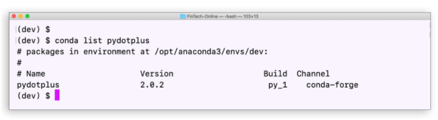

You're now all set up!

---

## Usage

To use the Logistic Regression Evaluation application, simply clone the repository and run the Jupyter Notebook **credit_risk_resampling.ipynb** either in VSC, or in Jupyter Lab.

Step 1: Import the required libraries and modules:

```python
import numpy as np
import pandas as pd
from pathlib import Path
from sklearn.metrics import balanced_accuracy_score
from sklearn.metrics import confusion_matrix
from imblearn.metrics import classification_report_imbalanced
from sklearn.preprocessing import StandardScaler
```

Step 2: Read the `lending_data.csv` data from the `Resources` folder into a Pandas DataFrame:

```python
# Read the CSV file from the Resources folder into a Pandas DataFrame
lending_df = pd.read_csv(
  Path("./Resources/lending_data.csv")
)

# Review the DataFrame
lending_df.head()
```

Step 3: Create the labels set (`y`)  from the “loan_status” column, and then create the features (`X`) DataFrame from the remaining columns:

```python
# Separate the data into labels and features

# Separate the y variable, the labels
y = lending_df["loan_status"]

# Separate the X variable, the features
X = lending_df.drop(columns="loan_status")
```

Verify that the individual dataframes are correctly divided:

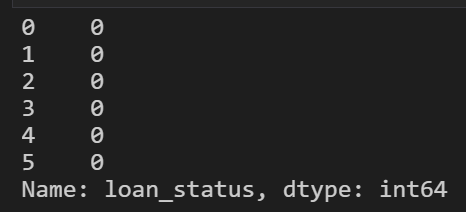

In the preceding image we can see that only the target `y` column is in this dataframe.

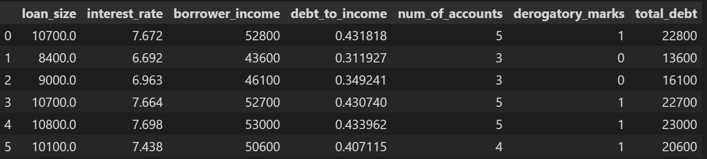

In the image above, we can verify that the target `y` column has been removed from this DataFrame.


Step 4: Check the balance of the labels variable (`y`) by using the `value_counts` function:

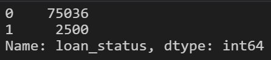

In the preceding image we can easily see the imbalance in the magnitude of classes.

Step 5: Split the data into training and testing datasets by using `train_test_split`:

```python
# Import the train_test_learn module
from sklearn.model_selection import train_test_split

# Split the data using train_test_split
# Assign a random_state of 1 to the function
X_train, X_test, y_train, y_test = train_test_split(X, y, random_state=1)
```

Step 6: Scale the Data:

```python
# Scale the data for X
scaler = StandardScaler()
X_scaler = scaler.fit(X_train)
X_train_scaled = X_scaler.transform(X_train)
X_test_scaled = X_scaler.transform(X_test)
```

Step 7: Fit a logistic regression model by using the training data (`X_train` and `y_train`):

```python
# Import the LogisticRegression module from SKLearn
from sklearn.linear_model import LogisticRegression

# Instantiate the Logistic Regression model
# Assign a random_state parameter of 1 to the model
model = LogisticRegression(random_state=1)

# Fit the model using training data
lr_original_model = model.fit(X_train_scaled, y_train)
lr_original_model
```
The following image shows the result from running this cell:

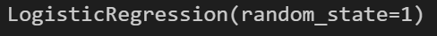

Step 8: Save the predictions on the testing data labels by using the testing feature data (`X_test`) and the fitted model:

```python
# Make a prediction using the testing data
y_original_pred = lr_original_model.predict(X_test_scaled)
```

Step 9: Evaluate the model’s performance by doing the following:

* Calculate the accuracy score of the model.

* Generate a confusion matrix.

* Print the classification report.

The following image displays the result from the accuracy score of the model:

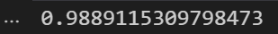

From the image, we can tell that the model achieved an accuracy score of 98.9% given original, imbalanced, data.

Next, we'll display the confusion matrix:

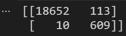

Finally, we'll display the classification report:

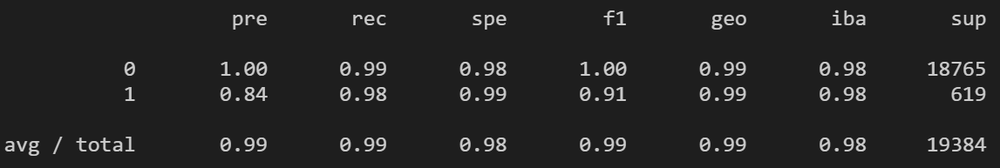

Step 10: Use the `RandomOverSampler` module from the imbalanced-learn library to resample the data. Be sure to confirm that the labels have an equal number of data points:

```python
# Import the RandomOverSampler module form imbalanced-learn
from imblearn.over_sampling import RandomOverSampler

# Instantiate the random oversampler model
# # Assign a random_state parameter of 1 to the model
random_oversampler = RandomOverSampler(random_state=1)

# Fit the original training data to the random_oversampler model
X_resampled, y_resampled = random_oversampler.fit_resample(X_train_scaled, y_train)
```

```python
# Count the distinct values of the resampled labels data
y_resampled.value_counts()
```
The following image displays the result from running these cells:

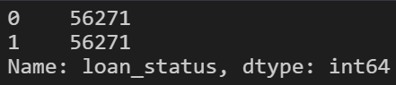

As we can see, our classes are now balanced. This means the model will have the potential to be more accurate for both classes.

Step 11: Use the `LogisticRegression` classifier and the resampled data to fit the model and make predictions:

```python
# Instantiate the Logistic Regression model
# Assign a random_state parameter of 1 to the model
model = LogisticRegression(random_state=1)

# Fit the model using the resampled training data
lr_resampled_model = model.fit(X_resampled, y_resampled)

# Make a prediction using the testing data
y_resampled_pred = lr_resampled_model.predict(X_test_scaled)
```

Step 12: Evaluate the model’s performance by doing the following:

* Calculate the accuracy score of the model.

* Generate a confusion matrix.

* Print the classification report.

The following image displays the result from the accuracy score of the model:

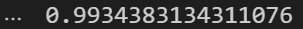

From the image, we can tell that the model achieved an accuracy score of 99.3% given oversampled, balanced, data. The second model improved on recall by approximately 1% after oversampling the minority class. 

Next, we'll display the confusion matrix:

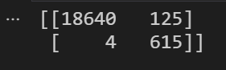

Finally, we'll display the classification report:

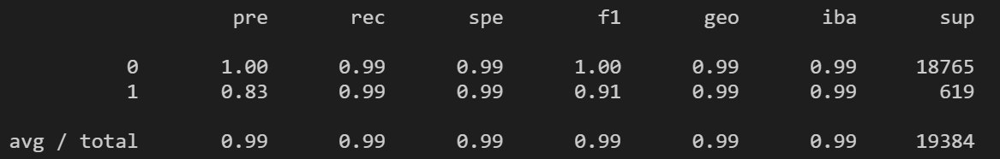

Step 13: Analyze the performance of both models:

The resampled data model continued to predict `0` at a very high percentage. The precision and recall remained the same at 100% and 99% respectively. It even managed to improve on the geo and spe metrics, albeit slightly.
However, when it comes to the `1` class, the recall did improve from 98% to 99%. This means that the ability for the model to predict high-risk-loans improved from the original, imbalanced, data. As we'd expect, with this increase in recall, we do have a small decline in precision. It went from 84% in the original data, to 83% in the resampled data. Recall and precision historically have a negative correlation. The more labels the model predicts correctly (recall), our confidence in those labels declines slightly (precision).

---

## Contributors

**Created by:** Tony Landero<br>
**Email Adress:** mr.landero@gmail.com

---

## License

MIT
